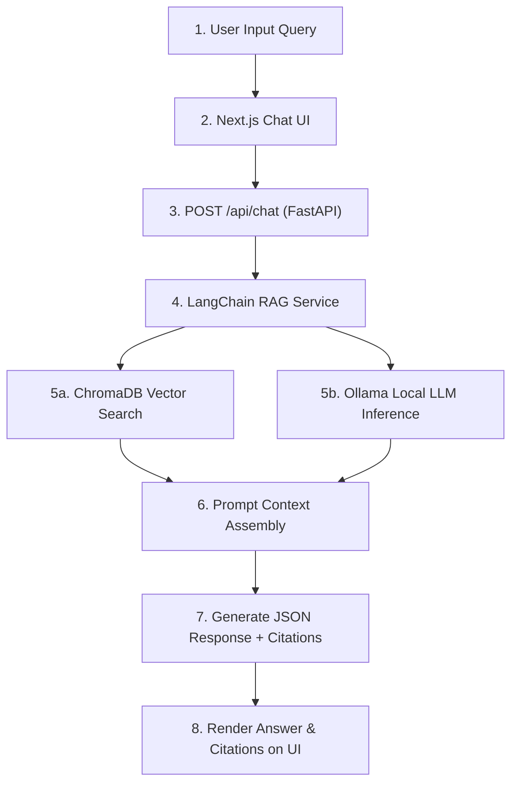

# CampusAI – AI Virtual Receptionist: Final Project Report

**Project:** CampusAI – AI Virtual Receptionist  
**Institution:** Centennial College — Software Engineering Fundamentals  
**Repository File:** `docs/FINAL_REPORT.md`  
**Completion Date:** August 2026  

---

## 1. Executive Summary

CampusAI is an AI-powered virtual receptionist designed to deliver real-time, accurate, and interactive informational support to students, visitors, and staff at Centennial College. By leveraging a Retrieval-Augmented Generation (RAG) architecture powered by a local open-source Large Language Model (Ollama `qwen2.5:3b-instruct`), CampusAI answers campus inquiries regarding admissions, course registration, tuition, financial aid, campus navigation, student services, and academic policies.

The system enforces strict data grounding by citing verified official college web sources and documents for every response, mitigating artificial intelligence hallucinations. CampusAI features a Next.js interactive chat interface, an animated avatar, Speech-to-Text (STT) input, Text-to-Speech (TTS) audio synthesis, and automated department recommendation logic.

---

## 2. Project Scope & Feature Matrix

The Minimum Viable Product (MVP) features were successfully implemented and verified across five sprint milestones:

| Feature Module | Technical Implementation | Functional Description | Status |
| :--- | :--- | :--- | :---: |
| **AI Chat Interface** | Next.js 14, React, Tailwind CSS | Conversational Q&A interface with message history, typing indicators, and responsive layouts. | Completed |
| **RAG Knowledge Base** | LangChain, ChromaDB, Sentence Transformers | Semantic document retrieval restricted to verified Centennial College knowledge files. | Completed |
| **Source Citations** | Metadata Tagging (Title, Excerpt, URL) | Displays explicit source links and document references alongside AI responses. | Completed |
| **Speech-to-Text (STT)** | Web Speech API | Converts spoken user queries into text input strings. | Completed |
| **Avatar & Text-to-Speech** | TalkingHead / Browser Speech Synthesis | Animated avatar visualizer with synchronized voice output and text fallback. | Completed |
| **Department Recommendation** | Prompt Guard & Fallback Logic | Suggests official department contact details when query confidence is low or ambiguous. | Completed |

---

## 3. System Architecture & Data Flow

### 3.1. Technical Stack

* **Frontend:** Next.js 14+ (TypeScript, React App Router), Tailwind CSS.
* **Backend:** Python 3.10+, FastAPI, Pydantic, Uvicorn.
* **AI Orchestration & LLM:** LangChain, Ollama (`qwen2.5:3b-instruct`), Sentence Transformers (`all-MiniLM-L6-v2`).
* **Vector Database:** ChromaDB (Local persistent storage in `backend/chromadb_data/`).
* **Protocols & Formats:** REST API (JSON payload), Web Speech API.

### 3.2. End-to-End Data Pipeline

1. **Client Request:** The Next.js frontend captures user input (text or speech) and dispatches a JSON payload to the FastAPI `/api/chat` endpoint.
2. **Semantic Search:** LangChain converts the input query into dense vector embeddings using `all-MiniLM-L6-v2` and executes a similarity search against the ChromaDB collection `centennial_knowledge_base`.
3. **Context Injection:** Relevant text chunks and metadata (document title, section, source URL) are formatted into a prompt template.
4. **Local Inference:** Ollama generates a response constrained strictly to the retrieved context chunks.
5. **Payload Formatting:** FastAPI serializes the response text and citation array into a standardized JSON response envelope.

---

## 4. Sprint Milestones & Timeline Summary

Development progressed through five structured Sprint Planning and Daily Scrum meetings:

* **Sprint 1 (July 25, 2026):** Finalized project scope, approved technology stack, established initial sprint backlog, and assigned core team roles.
* **Sprint 2 (July 27, 2026):** Initialized GitHub repository structure, created backend/frontend project skeletons, drafted PRD/SRS documents, and gathered initial institutional datasets.
* **Sprint 3 (July 30, 2026):** Completed core FastAPI endpoints (`/api/chat`, `/api/query`, `/api/feedback`, `/api/conversations`), initialized local ChromaDB vector store, and completed UI component specifications.
* **Sprint 4 (August 2, 2026):** Connected LangChain RAG pipeline to live ChromaDB vector store and Ollama model, enabled live citation rendering, and executed 20-question retrieval benchmark test suite.
* **Sprint 5 (August 3, 2026):** Integrated Speech-to-Text and Avatar/TTS modules, completed full end-to-end integration testing, finalized slide deck, and conducted demo rehearsals.

---

## 5. Team Roles & Contributions

| Team Member | Role | Key Deliverables & Responsibilities |
| :--- | :--- | :--- |
| **Abrar** | Project Lead / Scrum Master | Designed backend architecture, implemented FastAPI endpoints, integrated LangChain RAG pipeline, connected Ollama local LLM, and implemented Speech-to-Text & Avatar integration. |
| **Mathew** | AI Research Lead | Researched and curated official Centennial College knowledge sources, structured YAML metadata, initialized ChromaDB, and logged 20+ retrieval accuracy test cases. |
| **Syed** | UI/UX Lead | Designed Next.js frontend layout, authored design system specifications, implemented responsive chat UI components, and wired client interfaces to backend REST endpoints. |
| **Mark** | Documentation Lead | Authored Product Requirements Document (PRD), Software Requirements Specification (SRS), `API.md` contract, managed GitHub Projects board, and synthesized Final Report drafts. |
| **Nairobi** | QA & Presentation Lead | Authored Project Charter, developed QA Test Plan (`TEST_PLAN.md`), created 15+ slide presentation deck, authored Demo Script (`DEMO_SCRIPT.md`), and executed integration testing. |

---

## 6. Quality Assurance & Test Verification

The system underwent systematic testing across multiple operational layers as defined in `TEST_PLAN.md`:

### 6.1. Test Execution Summary

| Test ID | Testing Category | Description | Result |
| :--- | :--- | :--- | :---: |
| **TC-01** | Chat Interface | Basic Q&A rendering and session handling | PASS |
| **TC-03** | RAG Accuracy | Verified knowledge retrieval for campus admission requirements | PASS |
| **TC-04** | Guardrail Verification | Out-of-scope query handling without hallucination | PASS |
| **TC-05** | Source Citations | Verification of source title and URL rendering | PASS |
| **TC-07 / TC-08** | Avatar & TTS | Synchronized audio playback and visual avatar animation | PASS |
| **TC-12** | Performance | End-to-end query response latency (< 2.5 seconds) | PASS |

---

## 7. Future Enhancements & Strategic Roadmap

1. **Student Portal Authentication:** Integration with official student account APIs to support personalized queries (e.g., individual grades, tuition balances, course schedules).
2. **Multilingual Support:** Multi-language prompt translations to assist international students.
3. **Dynamic API Connectors:** Direct integration with live campus services for real-time shuttle tracking and library room bookings.

---

## 8. References & Documentation Links

* [FastAPI Framework Documentation](https://fastapi.tiangolo.com/)
* [LangChain Python Documentation](https://python.langchain.com/)
* [Next.js Documentation](https://nextjs.org/docs)
* [ChromaDB Vector Store Documentation](https://docs.trychroma.com/)
* [Centennial College Official Website](https://www.centennialcollege.ca/)
